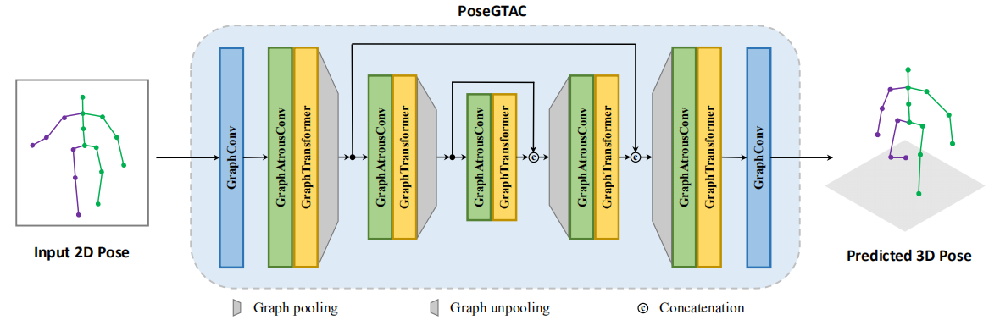

# PoseGTAC: Graph Transformer Encoder-Decoder with Atrous Convolution for 3D Human Pose Estimation

This repository is the **anonymous** Pytorch implementation of the PoseGTAC method.

<p align="center"></p>
<p align="center"></p>
<p align="center"></p>
<p align="center"></p>

[Note] : from left to right are the input, ground-truth and our PoseGTAC  prediction.

## Installation and Requirements

### Installation

We recommended the following dependencies:

- Python  2.7
- Pytorch  1.4.0
- h5py  2.10.0

## Training

### Data Download

Data Preparation: 

 Human3.6M: http://vision.imar.ro/human3.6m/description.php

 MPI-INF-3DHP: http://gvv.mpi-inf.mpg.de/3dhp-dataset

Note that these two datasets are publicly available and have been widely used in the community.

### Running

Run main.py to train and evaluate models

```
python main.py
python main.py --evaluate ${WEIGHT_PATH}
```

You can change the hyper-parameters if you want to try different configurations.

## Introduction

In this work, we proposed a novel Graph Transformer Encoder-Decoder with Atrous Convolution named PoseGTAC to extract effectively multi-scale contextual information and capture accurately global long-range relationships for 3D human pose estimation. Moreover, we designed two modules, graph atrous convolution (GAC) and graph transformer layer (GTL), respectively for the extraction of multi-scale and long-range information, and combine them in the encoder-decoder structure. 

<p align="center"></p>


### The State-of-the-art Performance

<p align="center"></p>

<p align="center"></p>

Table 1 and Table 2 respectively show the experiment results on the Human3.6M dataset for MPJPE and P-MPJPE. We can observe that the proposed PoseGTAC method obtains the best results in terms of the average and most individual actions.

<p align="center"></p>

We also provide supplementary to evaluate the smoothness (MPJVE) of the predicted pose by our PoseGTAC model. 

<p align="center"></p>

For MPI-INF-3DHP dataset, we train our PoseGTAC model with Human3.6M data without post-process of fine-tune or retrain. Table 3 shows the evaluation results using PCK and AUC. 